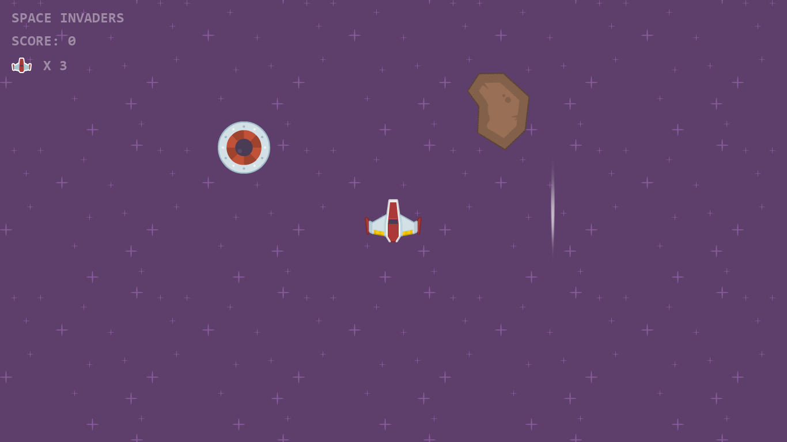

# Space Invaders

A prototype of a space shooter game developed in python with pygame. The main objective of the project is to learn Python in a fun way.



## Start here

1. You need to install pygame and pyaml:

```
pip install pygame pyaml
```

2. After that you can run the game:

```
python app.py
```

## Credits

Space Shooter graphics by Kenney Vleugels (www.kenney.nl)